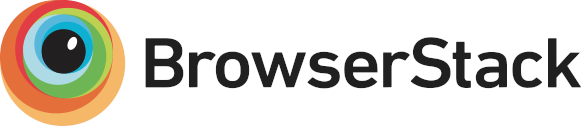

# Code Golf

[](https://travis-ci.org/JRaspass/code-golf) [](https://coveralls.io/github/JRaspass/code-golf)

This is the repository behind https://code-golf.io

## Quickstart

1. Install mkcert:
```
$ yay mkcert
```

2. Install the local CA:
```
$ mkcert -install localhost
Using the local CA at "~/.local/share/mkcert" ✨
The local CA is now installed in the system trust store! ⚡️
The local CA is now installed in the Firefox and/or Chrome/Chromium trust store (requires browser restart)! 🦊


Created a new certificate valid for the following names 📜
 - "localhost"

The certificate is at "./localhost.pem" and the key at "./localhost-key.pem" ✅
```

3. Build the assets:
```
$ ./build-assets
```

4. Bring up the website:
```
$ docker-compose up --build
```

5. Navigate to https://localhost

## Other

To build the various languages:

```
$ ./build-langs
```

## Thanks

[](https://www.browserstack.com)

Cross browser testing powered by [BrowserStack](https://www.browserstack.com)
